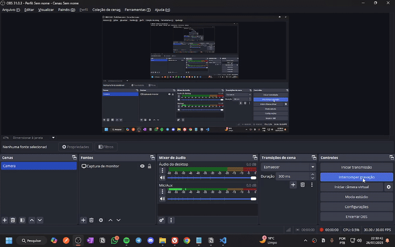

# 🎁 Challenge: Amigo Secreto  
**by Mateus Rodrigues**

Este projeto consiste em um desafio de JavaScript, cujo objetivo é implementar um **sorteador de amigo secreto** de forma interativa.

---

## 🧠 Sobre o projeto

O usuário pode adicionar os nomes dos participantes e, com um clique, o sistema realiza o sorteio, garantindo que **Todos os nomes sejam selecionados de maneira aleatória**.

---

## 📹 Demonstração

Abaixo está a demonstração do funcionamento:



---

## 🚀 Tecnologias utilizadas
- HTML
- CSS
- JavaScript (Vanilla)

---

## 📁 Como executar

1. Clone este repositório:
   ```bash
   git clone git@github.com:Covvalente/challenge-amigo-secreto_pt_Mateus.git
2.Navegue até a pasta:
   cd amigo-secreto
   
3.Abra o arquivo index.html no navegador
## ✨ Funcionalidades

- ✅ Adição de participantes
- ✅ Sorteio automático e justo
- ✅ Reset da lista e dos resultados
- ✅ Exibição dos pares sorteados

## 📬 Contato

Feito com ❤️ por **Mateus Rodrigues**  
🔗 [LinkedIn](https://www.linkedin.com/in/mateus-rodrigues-913329168/)
